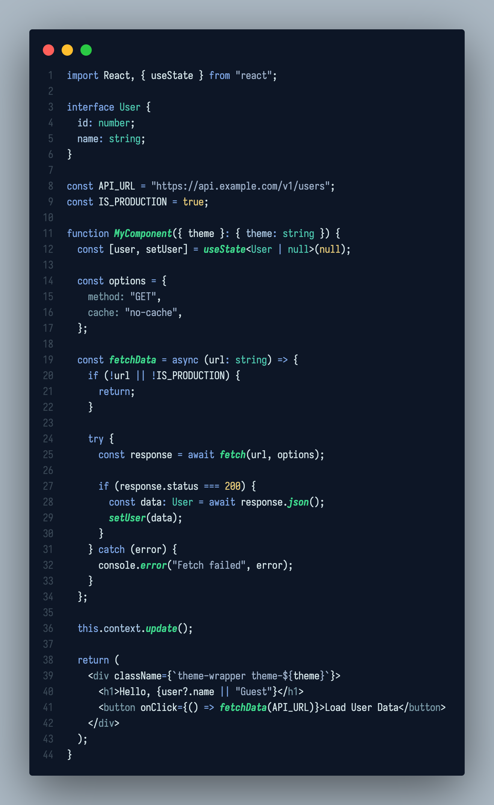
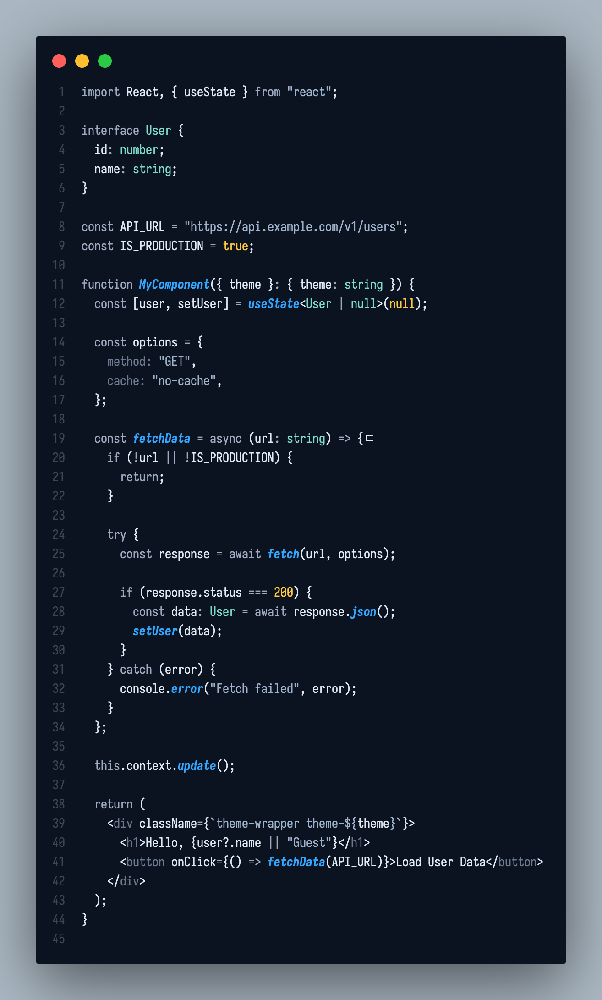
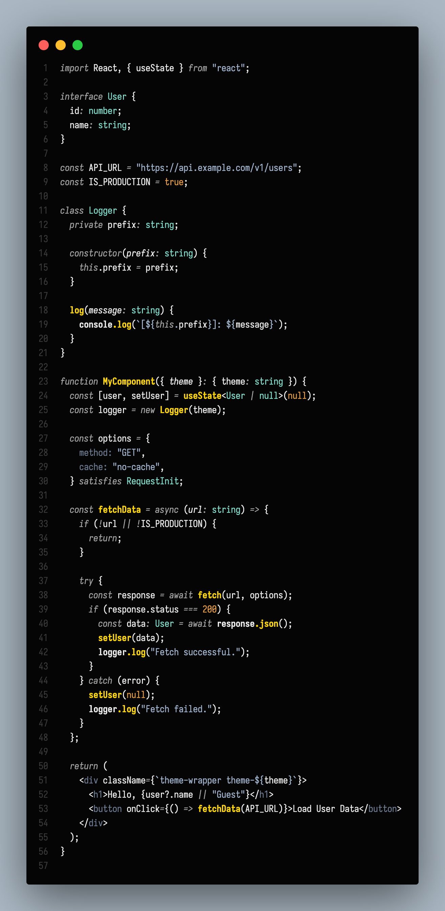
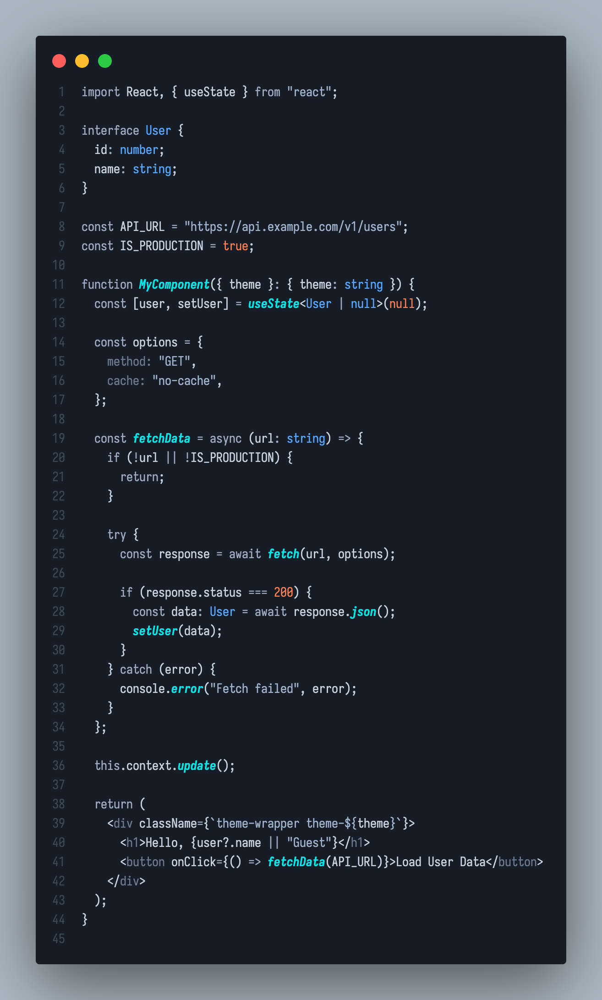
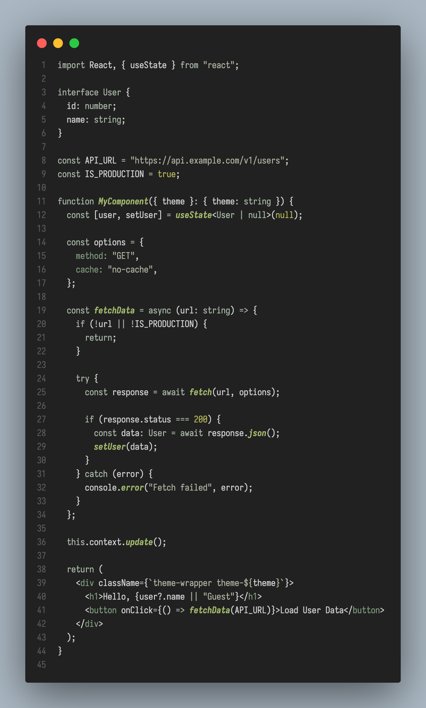

# Mintstream's Theme Package

[](https://marketplace.visualstudio.com/items?itemName=mintstream.mintstream-themes)
[](https://opensource.org/licenses/MIT)

여러 작업 환경에서의 개발 환경 유지를 위해 만든 테마 패키지.

## 🎨 테마 스펙트럼

### 1. Tactical Green



### 2. Foundry Blue



### 3. Operation Gold



### 4. Aero



### 5. Green Camo



---

<details>
<summary>Example</summary>

```typescript
import React, { useState } from "react";

interface User {
  id: number;
  name: string;
}

const API_URL =
  "[https://api.example.com/v1/users](https://api.example.com/v1/users)";
const IS_PRODUCTION = true;

function MyComponent({ theme }: { theme: string }) {
  const [user, setUser] = useState<User | null>(null);

  const options = {
    method: "GET",
    cache: "no-cache",
  };

  const fetchData = async (url: string) => {
    if (!url || !IS_PRODUCTION) {
      return;
    }

    try {
      const response = await fetch(url, options);

      if (response.status === 200) {
        const data: User = await response.json();
        setUser(data);
      }
    } catch (error) {
      console.error("Fetch failed", error);
    }
  };

  this.context.update();

  return (
    <div className={`theme-wrapper theme-${theme}`}>
      <h1>Hello, {user?.name || "Guest"}</h1>
      <button onClick={() => fetchData(API_URL)}>Load User Data</button>
    </div>
  );
}
```

</details>
